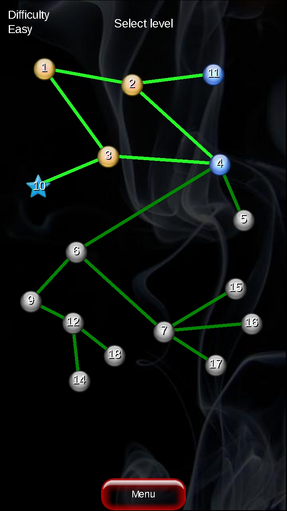
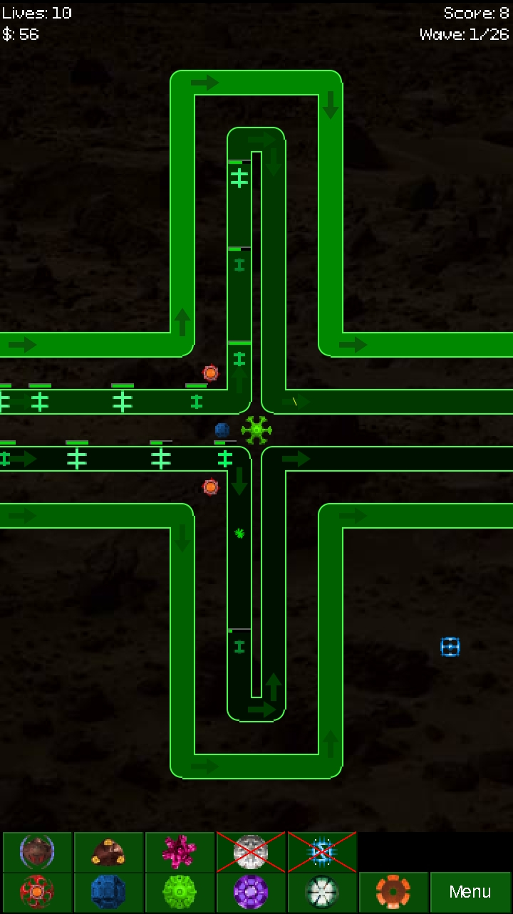
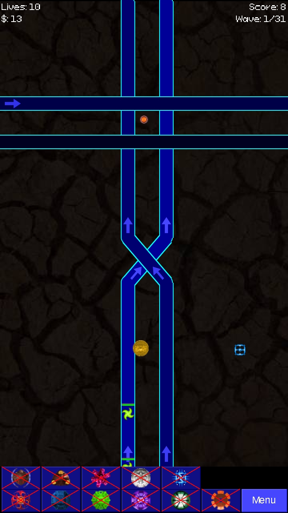
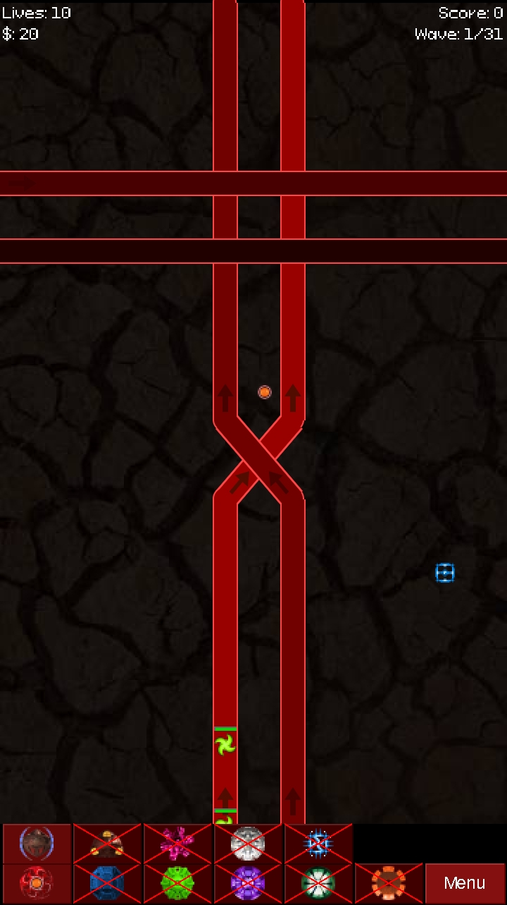

# AmazingTD — Amazing TD for Android

A remake of **Amazing TD** — a free-to-play J2ME tower-defense game created by **Johan Krüger in 2010** for the
Nokia 5800 XpressMusic (the jar's manifest: `MIDlet-Name: AmazingTD`, `MIDlet-Vendor: Johan Kruger`,
`MIDlet-Version: 0.99.33`) — as a normal Android app. I made it because my wife really loved that game, and
there is no way left to play it.

The port is a line-of-logic port of the original jar (decompiled with CFR), class by class. There are no
per-screen Activities and no XML layouts: one `Activity` hosts one `Screen`, a `View` that draws in the
original **360×640** design space (the 5800 XpressMusic's portrait screen) and scales it to the device, mapping
touches back through the same scale. Every ported class keeps an `Original: <obfuscated name>` tag in its Javadoc,
so any line here can be traced back to the decompiled source.

Everything the original had is here: **19 levels**, **11 towers**, **39 enemy types**, the main menu, level
select, instructions, options, high scores, the pause menu, and the cheat code.

## Preservation project

This is a non-commercial preservation of an obscure 2010 Symbian game that would otherwise be lost. The original 
was free-to-play, created by hobbyists, and is no longer playable on modern devices. This port exists to:

- Make the game playable again for those who remember it
- Preserve a piece of mobile gaming history
- Credit the original authors properly

No monetization. No ads. No in-app purchases. Just the game as it was, running on Android.

If you're Johan Krüger, Zuul, or anyone involved with the original — I'd love to hear from you 
(metalarchus@gmail.com). This exists because your work deserves to be remembered.

## Screenshots

Cropped to the original 360×640 design space at 2×, which is what the `Screen` view draws before scaling it to
the device.

| | |
|:--:|:--:|
|  |  |
|  |  |

## What differs from the original

1. **Fonts.** The original drew its text from PNG glyph sheets and relied on the phone's system fonts. Both are
   replaced with free (SIL Open Font License 1.1) TrueType fonts, bundled in `app/src/main/assets/fonts/`:
   *Pixeloid Sans* replaces the 13 px pixel sheet, *Liberation Sans* (Regular) replaces the 16 px MS-Sans-Serif
   sheet. `TrueTypeFont` picks a `textSize` whose `ascent + descent` equals the old glyph-box height, so nothing
   on screen shifts by a pixel.
2. **Splash damage is decoupled from the refresh rate.** The game advances on a fixed **50 ms** tick
   (`Screen.TICK = 50`, 20 steps/second) and explosion/splash damage is applied once per tick, never once per
   rendered frame. That is exactly what the original phone did by default — its loop slept between ticks and
   gave the game one tick each time — so a mortar shell on a 144 Hz phone now costs an enemy exactly what it
   cost on the 5800. Drawing rate and game rate are independent.
3. **Backlight flash → vibration.** The original flashed the keypad backlight; here that is a vibration pulse of
   the same length (and, as in the original, the "Vibration" setting does not gate it).
4. **Everything else is as close to the original as I could get** — the same pixel coordinates, the same 8 px
   grid snap, the same two-layer road with direction arrows, the same quirks (including the original's `Random`
   quirk and the original's habit of handing a drawer's leftover colour to the next drawer), the same obfuscated
   tower names in the shop (Autobow, Slow Tower, Mortar, Chaingun, Force Field Tower, Pulsed Laser, Detector,
   Money Tower, Sniper Tower, Tracking Laser, Missile Tower) and the same save format.

## Cheat code: unlock every level and every tower

The original's cheat is a four-corner tap gesture on the **level select** screen. All four corners are invisible
50×50 hotspots in the design space, and they must be tapped **in this exact order**:

| Step | Corner | Effect |
|------|--------|--------|
| 1 | top-left | advances the gesture, pulses 100 ms (the old backlight flash) |
| 2 | top-right | advances the gesture, pulses again |
| 3 | bottom-left | advances the gesture, pulses again |
| 4 | **bottom-right** | **toggles "all levels unlocked"** |

A wrong corner resets the sequence to step 1, so the order matters. Only the fourth tap does anything visible:
every level node lights up and becomes selectable, the four star nodes (levels 8, 10, 13, 19) and their
connector lines appear, and the two towers that are normally earned by clearing levels *without deaths* become
available in the shop immediately — Tracking Laser (normally 1 cleared level) and Missile Tower (normally 3).
Tap the same corner sequence again to switch back to your real progress.

The flag lives in memory only, exactly as in the original: cleared levels are re-read from the save file every
time the screen opens, and the cheat resets when the app restarts.

## Build

```bash
cd /path/to/amazingtd5800
export JAVA_HOME=path/to/java (optional)
export ANDROID_HOME=pat/to/adroid_sdk (optional)
./gradlew assembleDebug
```

## Layout

```
app/src/main/java/com/amazingtd5800/   one flat package, one file per ported class
app/src/main/assets/                   the jar's own resources: fonts/, images/, sounds/
app/src/main/res/                      launcher icon + theme only
icon/                                launcher icon SVG sources
```

Save data keeps the original's RMS record stores as private files in `getFilesDir()`, same names, same binary
format: `ATDsettings`, `clearedLevelsEasy`, `clearedLevels`, `clearedLevelsHard`. Each difficulty has its own store and
switching difficulty only reopens the one it needs, so the other difficulties keep their progress.

## Credits

This is a preservation port of a 2010 Symbian game that would otherwise be lost to time, and almost none of the content here
is mine. The same credits are shown in-game on the **About** screen:

| Role | Who |
|------|-----|
| Original Symbian game (2010) | Johan Krüger |
| This Android remake | Pavel Chalov |
| Graphics | Zuul |
| Sound effects | James Tubbritt (Fxhome.com), Brettsta (Fxhome.com) |
| Testing and balancing original game | Zuul, XRC Kingkoning |
| Level design | level 15 — jinsk8er · level 16 — XRC Kingkoning · level 17 — Zuul |

The sprites, enemy sheets, backgrounds and sounds under `app/src/main/assets/` came out of the jar exactly as they
were, unmodified; the port claims no authorship over them. The only assets the port swaps in are the two fonts.

## License

Four sets of terms sit inside this repository. `LICENSE` is MIT and covers the Java sources only — it grants
nothing over the game itself; everything else is spelled out in [`LICENSES.md`](LICENSES.md).

| What | Terms |
|------|-------|
| `app/src/main/java/**` (this port's code) | MIT — `LICENSE` |
| `app/src/main/assets/sounds/*.wav` | CC BY 3.0 — FxHome (site offline), authors credited above, files unmodified |
| `app/src/main/assets/fonts/**` | SIL OFL 1.1 — shipped with each font's own `License.txt`/`COPYRIGHT.txt` |
| `app/src/main/assets/images/**` — all of it drawn by Zuul for the original | all rights reserved; no licence was granted for any of it |
| The original game's code and the level layouts of 15–17 | their own authors'; no licence was granted |
| The title "Amazing TD" | no one's — a title shared with several unrelated games, used here only to name the work being ported |

The original shipped no licence files at all, so for its art there is nothing to reproduce: it is carried along,
credited under the handles the original's own credits use, and would be removed or replaced on request. If you
hold a right named anywhere in [`LICENSES.md`](LICENSES.md), write to **metalarchus@gmail.com**.
